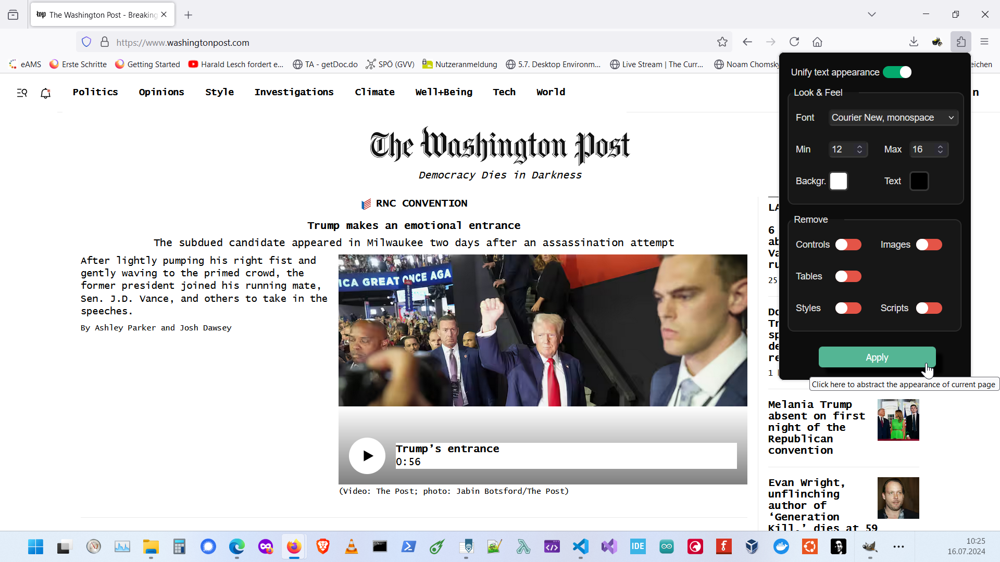

# Page-Abstractor

Click on this image to open the demonstration video:

**Page-Abstractor** enhances your web browsing experience by transforming web pages into simple, text-focused formats. It unifies colors and fonts, and removes distracting elements like images, controls, and tables. This add-on is ideal for users who want to focus on reading, copying, printing, or saving pure text content. It also offers customization options for font size and style, making it easier to read content in your preferred format. Enjoy a cleaner, more distraction-free browsing experience with Abstractor.

### Disclaimer:
Modifying HTML tags, styles, and scripts on web pages can lead to functional disruptions, potential data loss, or system damage. The author bears no responsibility for such outcomes resulting from the use of this add-on. Users are advised to proceed with caution and acknowledge the inherent risks involved.